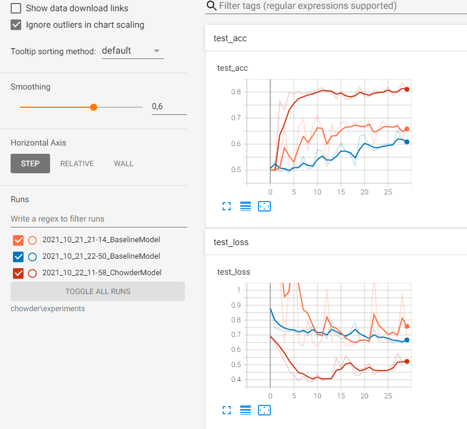

# Chowder Implementation

## Introduction
This repository contains an implementation of the CHOWDER method described in 
[this paper](https://arxiv.org/pdf/1802.02212.pdf).

The code is written in Python3+ and has been tested with version 3.7
It uses the Pytorch framework.

The package provides a main application that performs both training and evaluation on a given dataset following 
a certain folder tree structure (as the provided data folder does).

## Required items
The repository contains a report (`report.md`) containing:
  - a description of the implemented algorithm.
  - the design choices and the specifications of the code.
  - some experimental results.
  - some suggestions of improvement.
  
It also contains a `result` folder, which contains the required csv prediction files (`test_output.csv`) obtained with 
CHOWDER on the Camelyon16 dataset. The folder also contains the trained model under Pytorch custom format, and training
Tensorboard events. 

The "Run the application" section explains how to generate a new prediction file.  

## Installation 

can be installed via pip (ideally in a virtual environment) by running the following command: 
```pip install . ```

To run the tests and the different checks (type checking, lint), one can install additional dependencies in dev mode 
with commands: 
```
pip install -e .[dev]        # Install the dev dependencies ( .["dev"] can be required on certain OS for the command tu succeed)
pytest -s                    # Run the tests
mypy chowder                 # Run the static type checking
flake8                       # Run the lint tool
```

## Run the application

The main application is registered as an entry point. After installation, it can be run with the following command:

```chowder_train --data_folder /path/to/the/root/data/folder ```

NOTE: the medical data folder can be pasted directly at the root of the repository which is expected by default. 

The main application is written in `chowder/__main__.py`, one could also launch the application by running this file.

The application creates (if the folder does not exist yet) a `chowder/experiments` folder and stores the experiment 
results as well as the required prediction csv file in a dedicated folder named after the date and the model.

By default, the application uses the CHOWDER model implementation, but one could try to run the baseline method
method described in the paper and implemented in `chowder/model.py`. 

If several training are performed with the application, then several experiments are stored, and one can visualise some 
insights with Tensorboard, by running: `tensorboard --logdir chowder/experiments`. 

It produces a result as below:



## Package description 

To obtain an automatically generated package documentation, one can install the dev dependencies and run:
``` pdocs server chowder```

The package is organised as stated below, the docstrings in the code contain more precise information. 

```
chowder
  |-- __init__.py : Package init file
  |-- __main__.py : Main application script
  |-- data.py     : Data loading and manipulation utilities
  |-- dataset.py  : Implementation of dedicated torch compliant dataset  
  |-- model.py    : Implementation of the baseline and CHOWDER methods described in the paper
  |-- training.py : Training and evaluation routines

```